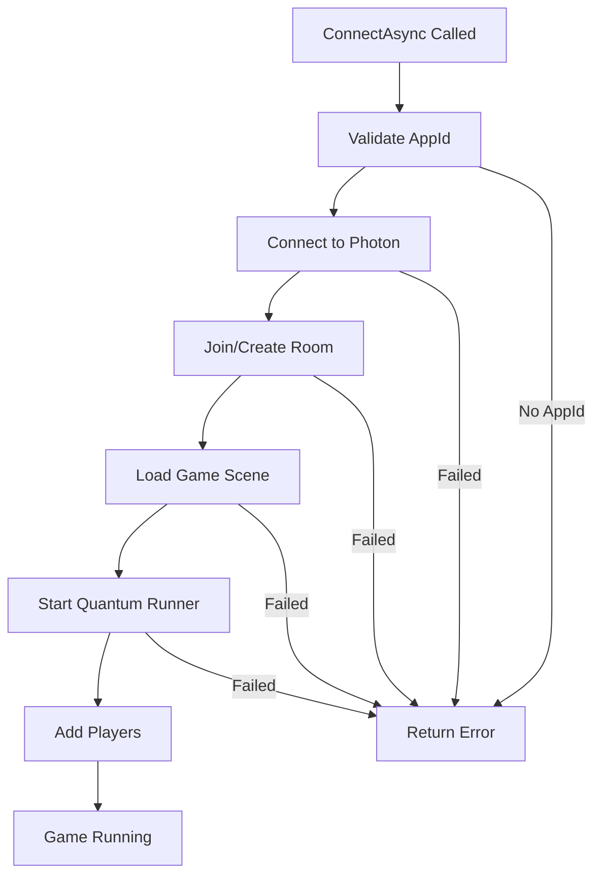

# Core Connection Functions

## Main Connection Method

### ConnectAsync()

The primary method for establishing a connection and starting a Quantum game.

```csharp
public async Task<ConnectResult> ConnectAsync(QuantumMenuConnectArgs connectArgs)
```

**Features:**
- Validates AppId automatically
- Handles region selection
- Creates or joins rooms
- Loads game scenes
- Starts Quantum runner
- Manages player data

### Example Usage

```csharp
// Full connection example
var connectArgs = new QuantumMenuConnectArgs
{
    // Required
    Scene = sceneInfo,                    // QuantumMenuSceneInfo
    Username = "PlayerName",              // Player display name
    MaxPlayerCount = 6,                   // Max players in room
    
    // Optional
    Region = "in",                        // Specific region (null for best)
    Session = "RoomName123",              // Specific room name
    Creating = false,                     // Force create new room
    AppVersion = "1.0",                   // Version for matchmaking
    
    // Advanced
    RuntimeConfig = customConfig,         // Custom game settings
    RuntimePlayers = new[] { player1 },   // Player data
    ReconnectInformation = reconnectInfo, // For reconnection
    
    // Custom data for your game
    CustomData = new Dictionary<string, object>
    {
        { "GameMode", "TeamBattle" },
        { "StakeLevel", 100 }
    }
};

var result = await connectionBehaviour.ConnectAsync(connectArgs);
```

## QuantumMenuConnectArgs Properties

**Source:** `/Assets/Photon/QuantumMenu/Runtime/QuantumMenuConnection.cs`

```csharp
public class QuantumMenuConnectArgs
{
    // Basic Settings
    public QuantumMenuSceneInfo Scene;           // Game scene/map info
    public string Username;                      // Player nickname
    public int MaxPlayerCount;                   // Max players (2-128)
    public string Region;                        // Target region
    public string AppVersion;                    // App version
    
    // Room Settings
    public string Session;                       // Room name
    public bool Creating;                        // Create vs join
    public bool Reconnecting;                    // Reconnection mode
    
    // Game Configuration
    public RuntimeConfig RuntimeConfig;          // Quantum runtime config
    public RuntimePlayer[] RuntimePlayers;       // Player data array
    public DeterministicSessionConfig SessionConfig;
    
    // Advanced Options
    public ReconnectInformation ReconnectInformation;
    public AuthenticationValues AuthValues;      // Custom auth
    public RecordingFlags RecordingFlags;       // Recording options
    public InstantReplaySettings InstantReplaySettings;
    
    // Server Settings
    public PhotonServerSettings ServerSettings;
    public int StartGameTimeoutInSeconds = 10;
    
    // Custom Data
    public Dictionary<string, object> CustomData; // Your game data
}
```

## Disconnect Method

```csharp
public async Task DisconnectAsync(int reason = 0)
```

**What it does:**
- Stops Quantum runner
- Unloads game scenes
- Cleans up resources
- Handles callbacks

### Example

```csharp
// User requested disconnect
await connectionBehaviour.DisconnectAsync(ConnectFailReason.UserRequest);

// Or simple disconnect
await connectionBehaviour.DisconnectAsync();
```

## Getting Available Regions

```csharp
public async Task<List<QuantumMenuOnlineRegion>> RequestAvailableOnlineRegionsAsync(
    QuantumMenuConnectArgs connectArgs)
```

### Example

```csharp
// Get regions with ping
var regions = await connectionBehaviour.RequestAvailableOnlineRegionsAsync(connectArgs);

foreach (var region in regions)
{
    Debug.Log($"Region: {region.Code}, Ping: {region.Ping}ms");
}

// Select best region
var bestRegion = regions.OrderBy(r => r.Ping).First();
connectArgs.Region = bestRegion.Code;
```

## Connection Properties

### Status Properties

```csharp
// Check connection status
bool isConnected = connectionBehaviour.IsConnected;
string currentRoom = connectionBehaviour.SessionName;
string currentRegion = connectionBehaviour.Region;
int ping = connectionBehaviour.Ping;
int maxPlayers = connectionBehaviour.MaxPlayerCount;

// Get connected players
List<string> playerNames = connectionBehaviour.Usernames;
```

### Direct Access

```csharp
// Access Photon client directly
RealtimeClient client = connectionBehaviour.Client;
if (client?.InRoom == true)
{
    var room = client.CurrentRoom;
    Debug.Log($"Room: {room.Name}, Players: {room.PlayerCount}/{room.MaxPlayers}");
}

// Access Quantum runner
QuantumRunner runner = connectionBehaviour.Runner;
if (runner?.Game != null)
{
    var frame = runner.Game.Frames.Verified;
    Debug.Log($"Tick: {frame.Number}");
}
```

## Connection Flow



## Real Examples from Samples

### Arena Brawler Connection
`/Volumes/ExSSD/Unity Projects/quantum-sports-arena-brawler-3.0.3/Assets/SportsArenaBrawler/Scripts/Menu/SportsArenaBrawlerMenuConnectionBehaviourSDK.cs`

```csharp
protected override void OnConnect(QuantumMenuConnectArgs connectArgs, 
    ref MatchmakingArguments args)
{
    args.RandomMatchingType = MatchmakingMode.FillRoom;
    args.Lobby = LocalPlayerCountManager.SQL_LOBBY;
    args.CustomLobbyProperties = new string[] { "TotalPlayers" };
    args.SqlLobbyFilter = $"TotalPlayers <= {maxAllowed}";
}
```

## Best Practices

1. **Always Handle Results**
```csharp
var result = await connection.ConnectAsync(args);
if (!result.Success)
{
    Debug.LogError($"Failed: {result.DebugMessage}");
    // Handle error
}
```

2. **Use Progress Callbacks**
```csharp
connectionBehaviour.ReportProgress += (status, progress) =>
{
    Debug.Log($"{status}: {progress * 100}%");
};
```

3. **Clean Disconnection**
```csharp
void OnApplicationPause(bool paused)
{
    if (paused && connectionBehaviour.IsConnected)
    {
        connectionBehaviour.DisconnectAsync();
    }
}
```

## Next: [[3. Customization and Extension]]
