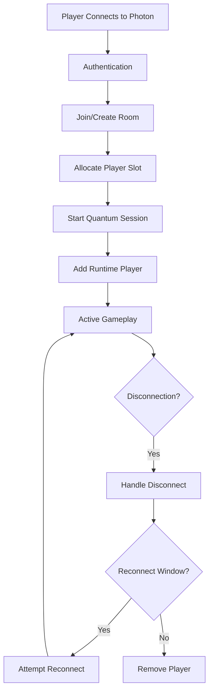

# Player Connection Management

This chapter provides comprehensive coverage of player connection lifecycle management in Photon Quantum 3, including connection establishment, disconnection handling, reconnection logic, and player state persistence.

## Overview

Player connection management in Quantum 3 handles:

- Initial player connection and authentication
- Player slot allocation and management
- Connection state monitoring
- Graceful disconnection handling
- Reconnection and late-joining
- Player data persistence
- Network quality monitoring
- Multi-client support

## Player Connection Lifecycle

### Connection Flow



### Initial Connection

**File: `/Assets/Photon/QuantumMenu/Runtime/QuantumMenuConnectionBehaviourSDK.cs`**

```csharp
protected override async Task<ConnectResult> ConnectAsyncInternal(QuantumMenuConnectArgs connectArgs) {
    // Validate connection arguments
    PatchConnectArgs(connectArgs);
    
    // Set up authentication
    if (connectArgs.AuthValues == null) {
        connectArgs.AuthValues = new AuthenticationValues {
            UserId = $"{connectArgs.Username}({new System.Random().Next(99999999):00000000}",
            AuthType = CustomAuthenticationType.None
        };
    }
    
    // Configure matchmaking
    var arguments = new MatchmakingArguments {
        PhotonSettings = new AppSettings(connectArgs.AppSettings),
        AuthValues = connectArgs.AuthValues,
        PlayerTtlInSeconds = connectArgs.ServerSettings.PlayerTtlInSeconds,
        AsyncConfig = new AsyncConfig {
            CancellationToken = _linkedCancellation.Token
        }
    };
    
    // Connect to room
    if (connectArgs.Reconnecting) {
        _client = await MatchmakingExtensions.ReconnectToRoomAsync(arguments);
    } else {
        _client = await MatchmakingExtensions.ConnectToRoomAsync(arguments);
    }
}
```

## Player Slot Management

### Adding Players to Game

**File: `/Assets/Photon/Quantum/Runtime/QuantumAddRuntimePlayers.cs`**

```csharp
public class QuantumAddRuntimePlayers : QuantumMonoBehaviour {
    public RuntimePlayer[] Players;
    
    public void Awake() {
        QuantumCallback.Subscribe(this, (CallbackGameStarted c) => 
            OnGameStarted(c.Game, c.IsResync), 
            game => game == QuantumRunner.Default.Game);
    }
    
    public void OnGameStarted(QuantumGame game, bool isResync) {
        for (int i = 0; i < Players.Length; i++) {
            game.AddPlayer(i, Players[i]);
        }
    }
}
```

### Player Data Structure

```csharp
// Runtime player configuration
public class RuntimePlayer {
    public string PlayerNickname;
    public AssetRef<EntityPrototype> PlayerAvatar;
    public byte[] CustomData;
}

// In-game player tracking
component PlayerLink {
    PlayerRef PlayerRef;
    bool IsConnected;
    FP DisconnectTime;
}
```

### Dynamic Player Addition

```csharp
public class DynamicPlayerManager : MonoBehaviour {
    public void AddPlayerDuringGame(int playerSlot, RuntimePlayer playerData) {
        var game = QuantumRunner.Default?.Game;
        if (game != null) {
            // Add player to specific slot
            game.AddPlayer(playerSlot, playerData);
            
            // Trigger player spawn
            game.Frames.Verified.Events.PlayerJoined(playerSlot);
        }
    }
    
    public void RemovePlayer(int playerSlot) {
        var game = QuantumRunner.Default?.Game;
        if (game != null) {
            game.RemovePlayer(playerSlot);
            game.Frames.Verified.Events.PlayerLeft(playerSlot);
        }
    }
}
```

## Connection State Monitoring

### Player Presence Detection

```csharp
public unsafe class PlayerConnectionMonitor : SystemMainThread {
    public override void Update(Frame f) {
        for (int i = 0; i < f.SessionConfig.PlayerCount; i++) {
            var inputFlags = f.GetPlayerInputFlags(i);
            bool isPresent = (inputFlags & DeterministicInputFlags.PlayerNotPresent) == 0;
            bool wasPresent = f.GetPlayerData(i) != null;
            
            if (!isPresent && wasPresent) {
                // Player disconnected
                HandlePlayerDisconnect(f, i);
            } else if (isPresent && !wasPresent) {
                // Player connected/reconnected
                HandlePlayerConnect(f, i);
            }
        }
    }
    
    void HandlePlayerDisconnect(Frame f, PlayerRef player) {
        // Mark disconnection time
        var filter = f.Filter<PlayerLink>();
        while (filter.NextUnsafe(out var entity, out var link)) {
            if (link->PlayerRef == player) {
                link->IsConnected = false;
                link->DisconnectTime = f.Time;
                f.Events.PlayerDisconnected(player);
                break;
            }
        }
    }
}
```

### Network Quality Monitoring

```csharp
public class NetworkQualityMonitor : MonoBehaviour {
    private QuantumRunner _runner;
    
    void Update() {
        if (_runner?.Session != null) {
            var stats = _runner.Session.Stats;
            
            // Monitor connection quality
            int ping = stats.Ping;
            float packetLoss = stats.PacketLoss;
            
            if (ping > 200 || packetLoss > 0.05f) {
                ShowPoorConnectionWarning(ping, packetLoss);
            }
            
            // Check for prolonged input delay
            if (stats.InputDelay > 10) {
                ShowInputDelayWarning(stats.InputDelay);
            }
        }
    }
}
```

## Disconnection Handling

### Graceful Disconnection

```csharp
public class DisconnectionHandler : QuantumMenuConnectionBehaviourSDK {
    protected override async Task DisconnectAsyncInternal(int reason) {
        if (reason == ConnectFailReason.UserRequest) {
            // Clean user-initiated disconnect
            QuantumReconnectInformation.Reset();
            
            // Notify other players
            if (Runner?.Game != null) {
                Runner.Game.Frames.Verified.Events.PlayerLeavingIntentionally(
                    Runner.Game.GetLocalPlayers()[0]);
            }
        }
        
        // Cleanup
        await CleanupAsync();
    }
    
    private async Task CleanupAsync() {
        // Shutdown runner
        if (Runner != null && (_shutdownFlags & QuantumMenuConnectionShutdownFlag.ShutdownRunner) != 0) {
            await Runner.ShutdownAsync();
        }
        
        // Disconnect client
        if (Client != null && (_shutdownFlags & QuantumMenuConnectionShutdownFlag.Disconnect) != 0) {
            await Client.DisconnectAsync();
        }
        
        // Unload scene if needed
        if (!string.IsNullOrEmpty(_loadedScene)) {
            await SceneManager.UnloadSceneAsync(_loadedScene);
        }
    }
}
```

### Handling Unexpected Disconnections

```csharp
public class UnexpectedDisconnectHandler : MonoBehaviour {
    void Start() {
        var connection = GetComponent<QuantumMenuConnectionBehaviourSDK>();
        connection.SessionShutdownEvent += OnSessionShutdown;
    }
    
    void OnSessionShutdown(ShutdownCause cause, SessionRunner runner) {
        switch (cause) {
            case ShutdownCause.NetworkError:
                ShowReconnectDialog("Network error. Reconnect?");
                break;
                
            case ShutdownCause.SessionFull:
                ShowErrorMessage("Session is full");
                break;
                
            case ShutdownCause.DisconnectedByServer:
                HandleServerDisconnect();
                break;
                
            case ShutdownCause.Ok:
                // Normal shutdown
                break;
        }
    }
}
```

## Reconnection System

### Storing Reconnection Information

```csharp
public static class QuantumReconnectInformation {
    private const string KEY_ROOM_NAME = "Quantum.Reconnect.RoomName";
    private const string KEY_REGION = "Quantum.Reconnect.Region";
    private const string KEY_APP_VERSION = "Quantum.Reconnect.AppVersion";
    private const string KEY_DISCONNECT_TIME = "Quantum.Reconnect.Time";
    
    public static void Store(RealtimeClient client) {
        if (client?.CurrentRoom != null) {
            PlayerPrefs.SetString(KEY_ROOM_NAME, client.CurrentRoom.Name);
            PlayerPrefs.SetString(KEY_REGION, client.CurrentRegion);
            PlayerPrefs.SetString(KEY_APP_VERSION, client.AppSettings.AppVersion);
            PlayerPrefs.SetString(KEY_DISCONNECT_TIME, DateTime.UtcNow.ToString());
            PlayerPrefs.Save();
        }
    }
    
    public static bool CanReconnect() {
        if (!PlayerPrefs.HasKey(KEY_DISCONNECT_TIME)) return false;
        
        var disconnectTime = DateTime.Parse(PlayerPrefs.GetString(KEY_DISCONNECT_TIME));
        var timeSinceDisconnect = DateTime.UtcNow - disconnectTime;
        
        // Check if within reconnection window (e.g., 30 seconds)
        return timeSinceDisconnect.TotalSeconds < 30;
    }
    
    public static ReconnectInformation GetReconnectInfo() {
        return new ReconnectInformation {
            RoomName = PlayerPrefs.GetString(KEY_ROOM_NAME),
            Region = PlayerPrefs.GetString(KEY_REGION),
            AppVersion = PlayerPrefs.GetString(KEY_APP_VERSION)
        };
    }
}
```

### Implementing Reconnection

```csharp
public class ReconnectionManager : MonoBehaviour {
    public async Task<bool> AttemptReconnection() {
        if (!QuantumReconnectInformation.CanReconnect()) {
            return false;
        }
        
        var reconnectInfo = QuantumReconnectInformation.GetReconnectInfo();
        var connectArgs = new QuantumMenuConnectArgs {
            Session = reconnectInfo.RoomName,
            Region = reconnectInfo.Region,
            AppVersion = reconnectInfo.AppVersion,
            Reconnecting = true,
            ReconnectInformation = reconnectInfo
        };
        
        var connection = GetComponent<QuantumMenuConnectionBehaviourSDK>();
        var result = await connection.ConnectAsync(connectArgs);
        
        if (result.Success) {
            Debug.Log("Reconnection successful!");
            RestorePlayerState();
            return true;
        }
        
        return false;
    }
    
    void RestorePlayerState() {
        // Restore player to previous state
        QuantumCallback.Subscribe(this, (CallbackGameStarted c) => {
            if (c.IsResync) {
                Debug.Log($"Resyncing at tick: {c.Game.Frames.Verified.Number}");
                // Player state is automatically restored by Quantum
            }
        });
    }
}
```

## Late-Join Support

### Enabling Late-Join

```csharp
public class LateJoinConfiguration : QuantumMenuConnectionBehaviourSDK {
    protected override void OnConnect(QuantumMenuConnectArgs connectArgs, ref MatchmakingArguments args) {
        // Configure room for late-joining
        args.RoomOptions = new RoomOptions {
            MaxPlayers = connectArgs.MaxPlayerCount,
            IsOpen = true,  // Allow new players to join
            IsVisible = true,  // Visible in lobby listings
            PlayerTtl = 0,  // No reconnection window for late-joiners
            PublishUserId = true  // Share user IDs for identification
        };
    }
    
    protected override void OnStarted(QuantumRunner runner) {
        // Handle late-join specific setup
        if (runner.IsLatejoin) {
            Debug.Log("Late-joining game in progress");
            RequestCurrentGameState();
        }
    }
}
```

### Syncing Late-Joiners

```csharp
public class LateJoinSync : SystemSignalsOnly, ISignalOnPlayerConnected {
    public void OnPlayerConnected(Frame f, PlayerRef player) {
        // Send current game state to new player
        if (f.IsVerified) {
            var gameState = new GameStateSnapshot {
                CurrentScore = f.Global->Score,
                TimeRemaining = f.Global->TimeRemaining,
                GamePhase = f.Global->CurrentPhase
            };
            
            f.Events.SyncGameState(player, gameState);
        }
    }
}
```

## Player Management Patterns

### Player Registry

**From Quantum Karts Sample:**
**File: `/Assets/Scripts/Managers/PlayerManager.cs`**

```csharp
public class PlayerManager : MonoSingleton<PlayerManager> {
    public Dictionary<PlayerRef, KartViewController> PlayerKarts { get; private set; } = new();
    public Dictionary<PlayerRef, KartViewController> BotKarts { get; private set; } = new();
    
    public void RegisterPlayer(QuantumGame game, KartViewController kartView) {
        if (kartView.isAI) {
            BotKarts[kartView._AIIndex] = kartView;
        } else {
            PlayerKarts[kartView.PlayerRef] = kartView;
        }
        
        // Register local player
        if (game.GetLocalPlayers().Count > 0 && 
            kartView.PlayerRef == game.GetLocalPlayers()[0]) {
            LocalPlayerManager.Instance.RegisterLocalPlayer(kartView);
        }
    }
    
    public void UnregisterPlayer(QuantumGame game, KartViewController kartView) {
        PlayerKarts.Remove(kartView.PlayerRef);
    }
}
```

### Local Player Management

**File: `/Assets/Scripts/Managers/LocalPlayerManager.cs`**

```csharp
public class LocalPlayerManager : MonoSingleton<LocalPlayerManager> {
    [SerializeField] private FP _predictionCullingRange;
    [SerializeField] private FP _predictionCullingFowardOffset;
    
    public QuantumEntityView LocalPlayerView { get; private set; }
    public KartViewController LocalPlayerKartView { get; private set; }
    public EntityRef LocalPlayerEntity { get; private set; }
    public PlayerRef LocalPlayerRef { get; private set; }
    
    public void RegisterLocalPlayer(KartViewController localPlayerKartView) {
        LocalPlayerView = localPlayerKartView.EntityView;
        LocalPlayerKartView = localPlayerKartView;
        LocalPlayerEntity = localPlayerKartView.EntityView.EntityRef;
        LocalPlayerRef = localPlayerKartView.PlayerRef;
        
        // Add prediction culling for optimization
        var predictionCullingController = localPlayerKartView.gameObject
            .AddComponent<PredictionCullingController>();
        predictionCullingController.Range = _predictionCullingRange;
        predictionCullingController.FowardOffset = _predictionCullingFowardOffset;
    }
}
```

## Multi-Client Support

### Multiple Local Players

```csharp
public class MultiClientManager : MonoBehaviour {
    [SerializeField] private int _maxLocalPlayers = 4;
    private Dictionary<int, QuantumRunner> _runners = new();
    
    public async Task ConnectMultipleClients(int playerCount) {
        for (int i = 0; i < playerCount; i++) {
            var connectArgs = new QuantumMenuConnectArgs {
                Username = $"Player{i + 1}",
                RuntimePlayers = new[] { 
                    new RuntimePlayer { 
                        PlayerNickname = $"Player{i + 1}" 
                    } 
                }
            };
            
            // Create separate runner for each client
            var runner = await StartClientRunner(connectArgs, i);
            _runners[i] = runner;
        }
    }
}
```

## Connection Events and Callbacks

### Comprehensive Event Handling

```csharp
public class ConnectionEventHandler : MonoBehaviour {
    void Start() {
        // Quantum callbacks
        QuantumCallback.Subscribe(this, (CallbackPlayerAdded c) => OnPlayerAdded(c));
        QuantumCallback.Subscribe(this, (CallbackPlayerRemoved c) => OnPlayerRemoved(c));
        QuantumCallback.Subscribe(this, (CallbackPlayerDataSet c) => OnPlayerDataSet(c));
        
        // Photon callbacks
        var client = QuantumRunner.Default?.NetworkClient;
        if (client != null) {
            client.CallbackMessage.Listen<OnDisconnectedMsg>(OnDisconnected);
            client.CallbackMessage.Listen<OnPlayerEnteredRoomMsg>(OnPlayerEntered);
            client.CallbackMessage.Listen<OnPlayerLeftRoomMsg>(OnPlayerLeft);
        }
    }
    
    void OnPlayerAdded(CallbackPlayerAdded callback) {
        Debug.Log($"Player {callback.PlayerSlot} added to game");
        UpdatePlayerUI(callback.PlayerSlot, true);
    }
    
    void OnPlayerRemoved(CallbackPlayerRemoved callback) {
        Debug.Log($"Player {callback.PlayerSlot} removed from game");
        UpdatePlayerUI(callback.PlayerSlot, false);
    }
    
    void OnPlayerDataSet(CallbackPlayerDataSet callback) {
        var playerData = callback.Game.GetPlayerData(callback.PlayerSlot);
        Debug.Log($"Player {callback.PlayerSlot} data updated: {playerData.PlayerNickname}");
    }
}
```

## Best Practices

1. **Always handle disconnection gracefully** - Store state for reconnection
2. **Implement timeout windows** - Balance between allowing reconnection and game flow
3. **Validate player slots** - Ensure proper allocation and deallocation
4. **Monitor connection quality** - Provide feedback for poor connections
5. **Test edge cases** - Simultaneous connections, rapid reconnects
6. **Secure player data** - Validate authentication and player identity
7. **Optimize for late-joiners** - Minimize data needed for sync
8. **Handle host migration** - Ensure continuity when host disconnects
9. **Implement proper cleanup** - Prevent memory leaks and hanging connections
10. **Provide clear feedback** - Keep players informed of connection status

## Error Handling

```csharp
public class ConnectionErrorHandler : MonoBehaviour {
    void HandleConnectionError(ConnectResult result) {
        switch (result.FailReason) {
            case ConnectFailReason.NoAppId:
                ShowError("Application ID not configured");
                break;
                
            case ConnectFailReason.SessionFull:
                ShowError("Game session is full");
                break;
                
            case ConnectFailReason.Disconnect:
                if (result.DisconnectCause == (int)DisconnectCause.ServerTimeout) {
                    ShowError("Connection timeout - check your internet");
                } else {
                    ShowError($"Disconnected: {(DisconnectCause)result.DisconnectCause}");
                }
                break;
                
            case ConnectFailReason.PluginError:
                ShowError($"Server error: {result.DebugMessage}");
                break;
        }
    }
}
```

This comprehensive player connection management system ensures robust handling of all player lifecycle events, from initial connection through disconnection and potential reconnection, providing a seamless multiplayer experience.
